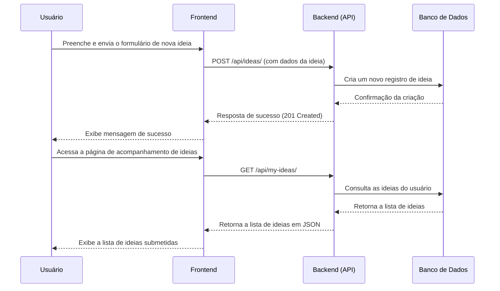

# O Projeto "Banco de Ideias"

O "Banco de Ideias" é uma plataforma de inovação projetada para otimizar o fluxo de trabalho e a especialização dentro da nossa organização. A plataforma permite que os colaboradores submetam, acompanhem e colaborem em ideias inovadoras, fomentando uma cultura de melhoria contínua e criatividade.

## Tecnologias Utilizadas

**Backend:**
- Python 3.12
- Django 5.2
- Django REST Framework
- dj-rest-auth
- drf-spectacular (para documentação da API)
- PostgreSQL

**Frontend:**
- React 19
- React Router
- Axios
- Tailwind CSS

## Como Executar o Projeto Localmente

Siga estas instruções para configurar e executar o projeto em seu ambiente de desenvolvimento local.

### Pré-requisitos

- Python 3.12 ou superior
- Node.js e npm
- PostgreSQL

### Backend

1.  **Clone o repositório:**
    ```bash
    git clone <url-do-repositorio>
    cd <diretorio-do-projeto>/backend
    ```

2.  **Crie e ative um ambiente virtual:**
    ```bash
    python -m venv venv
    source venv/bin/activate  # No Windows, use `venv\Scripts\activate`
    ```

3.  **Instale as dependências:**
    ```bash
    pip install -r requirements.txt
    ```

4.  **Configure o banco de dados:**
    - Certifique-se de que o PostgreSQL esteja em execução.
    - Configure as credenciais do banco de dados no arquivo `backend/idea_bank/settings.py`.

5.  **Aplique as migrações:**
    ```bash
    python manage.py migrate
    ```

6.  **Inicie o servidor de desenvolvimento:**
    ```bash
    python manage.py runserver
    ```
    O servidor backend estará disponível em `http://localhost:8000`.

### Frontend

1.  **Navegue até o diretório do frontend:**
    ```bash
    cd ../frontend
    ```

2.  **Instale as dependências:**
    ```bash
    npm install
    ```

3.  **Inicie o servidor de desenvolvimento:**
    ```bash
    npm start
    ```
    A aplicação frontend estará disponível em `http://localhost:3000`.

## Estrutura do Projeto

```
.
├── backend/            # Contém todo o código do Django (servidor)
│   ├── api/            # Aplicação Django para a API REST
│   │   ├── migrations/ # Migrações do banco de dados
│   │   ├── models.py   # Modelos de dados do Django
│   │   ├── serializers.py # Serializers para os modelos
│   │   ├── tests.py    # Testes para a API
│   │   └── views.py    # Views da API (endpoints)
│   ├── idea_bank/      # Configurações do projeto Django
│   │   ├── settings.py # Configurações principais
│   │   └── urls.py     # URLs principais do projeto
│   └── manage.py       # Utilitário de linha de comando do Django
├── frontend/           # Contém todo o código do React (cliente)
│   ├── public/         # Arquivos públicos
│   └── src/            # Código fonte do React
│       ├── components/ # Componentes reutilizáveis
│       ├── pages/      # Páginas da aplicação
│       └── services/   # Lógica de comunicação com a API
└── README.md           # Este arquivo
```

## Fluxo Principal da Aplicação (Diagrama)

O diagrama a seguir ilustra o fluxo de submissão e acompanhamento de uma nova ideia.


