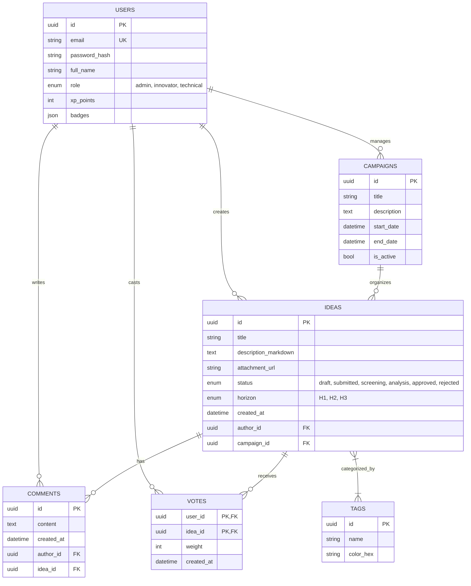
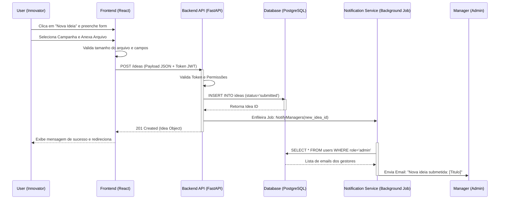

# Arquitetura do Sistema

Este documento apresenta os diagramas estruturais e comportamentais da plataforma.

## 1. Diagrama de Entidade-Relacionamento (ERD)

Representação do modelo de dados relacional (PostgreSQL).

## 2. Diagrama de Sequência: Submissão de Ideia

Fluxo detalhado desde a ação do usuário até a notificação dos gestores.

